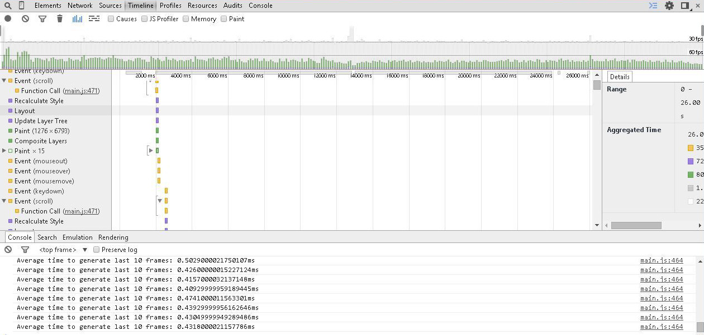

# Website Performance Optimization Project

The challenge was to optimize this online portfolio for speed.

In particular, optimize the critical rendering path and make index.html render as quickly as possible. Also, change how the little pizzas moved when scrolled in pizza.html so that there is no jank (a consistent 60 fps frame rate). Lastly, improve the resizing of the menu pizzas when a different pizza size is selected by a user changing the slider.

## Goals

### Part 1: Optimize PageSpeed Insights Score for index.html

Optimize the html and css to achieve a PageSpeed Insights score of 90+ for Mobile and Desktop.

### Part 2: Optimize Frames per Second in pizza.html

Identify and perform optimizations ensuring a consistent frame rate of 60fps when scrolling in pizza.html.

The target timeline should look something like this (or better):

 

### Part 3: Optimize Time to Resize Pizzas

The time to resize the menu pizzas (as reported by console.log) should be less than 5ms.

### Part 4: Use Gulp to Build the Project

Use the task runner Gulp to build the project and automatically perform
optimizations such as minify CSS and JS, and image resizing and compression.

### Part 5: Create a README File

Include a README.md file (this file) that details all steps required to successfully run the application. Also include a description of the optimizations made.

## Optimizations

### Changes to index.html

1. Opening the link https://fonts.googleapis.com/css?family=Open+Sans:400,700
 reveals the loading of a number of fonts associated with the "Open Sans" font family.
 Most of these (for example: cyrillic, greek, and vietnamese extensions) are not needed. So, it will save considerable resources to only load the latin font for weights 400 and 700.

 Created open-sans.css file and then included a minified version of it in index.html.

2. Since loading external css is rendering blocking and the file style.css is fairly small, adding it inline saves time by removing an HTTP request.

 Included a minified version of style.css and included it in index.html.

3. The file pizzeria.jpg was too large and took considerable time to load.

 Reduced the size of pizzeria.jpg using the gulp-image-resize plugin. Used the online service http://compressjpeg.com/ to compress pizzeria.jpg and profilepic.jpg.

4. Minified files take less time to load.

 Used gulp-minify-css, gulp-minify-html, and gulp-uglify plugins to minify files.

5. PageSpeed Insights looks for browser caching, and gzip compression as part of its optimization rubric.

 While the python SimpleHTTPServer does not seem to provide caching and gzip, my brainydesigns.net apache server does.

6. Installing the production build of the project at http://brainydesigns.net/perf gives index.html scores of 100/100 for both Mobile and Desktop.

### Changes to Achieve 60fps

1. The JavaScript file main.js was originally creating 200 little pizzas even when the browser window would only display a much smaller number.

 Changed the code to find the browser's width and height. Then created the variable called PizzaCount based on the browser's window size and generated only that number of little pizzas.

2. The function updatePositions() required rewriting.
  1. The phase value depends on the modulo operator '%' of 5, which means there are only 5 values for phase. Moving that calculation out of the major 'for-loop' reduces the number of calculations.
  2. DOM calls are very expensive. Eliminate them or reduce them whenever possible. Removed document.body.scrollTop from inside the major 'for-loop' and replaced it with latestKnownScrollY as calculated inside onScroll() function.
  3. Used Paul Lewis' method for 'Debouncing Scroll Events' by adding functions onScroll(), requestTick(), and requestAnimationFrame().

 3. After JavaScript optimization, paint times according to DevTools was still a major problem. According to Paul Lewis, "Obviously if you have things moving as you scroll, like in a parallax site [or, in this case, sliding pizzas], then you're potentially damaging a large area, possibly across multiple layers, and this can result in a lot of expensive paint work.[5]"

 And David Walsh suggests, "The use of translate3d pushes CSS animations into hardware acceleration.[6]"

 Added lines to the mover class in the css file to reduce repaint times.

      -webkit-backface-visibility: hidden;
      backface-visibility: hidden;
      -webkit-transform: translate3d(0, 0, 0);
      -ms-transform: translate3d(0, 0, 0);
      transform: translate3d(0, 0, 0);

## Resources

  1. "Effective Optimizations For 60 FPS" by Mark Nguyen
        https://goo.gl/YnA8nS

  2. "High Performance JavaScript" by Nickolas C. Jakas (book)

  3. "Planning for Performance" by Scott Jehl (11/25/2014)
    http://alistapart.com/article/planning-for-performance

  4. "Leaner, Meaner, Faster Animations with requestAnimationFrame" by Paul Lewis
   http://www.html5rocks.com/en/tutorials/speed/animations/

  5. "Scrolling Performance" by Paul Lewis
 http://www.html5rocks.com/en/tutorials/speed/scrolling/

  6. Force Hardware Acceleration in WebKit with translate3d by David Walsh (3/12/2013)
  https://davidwalsh.name/translate3d
